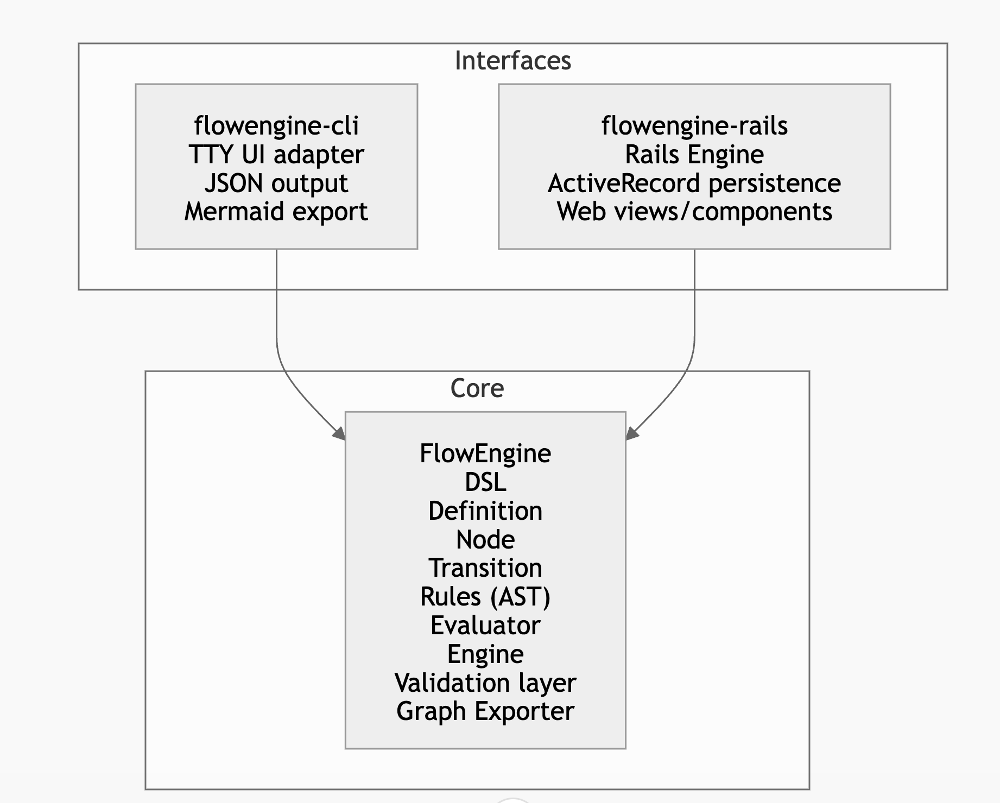
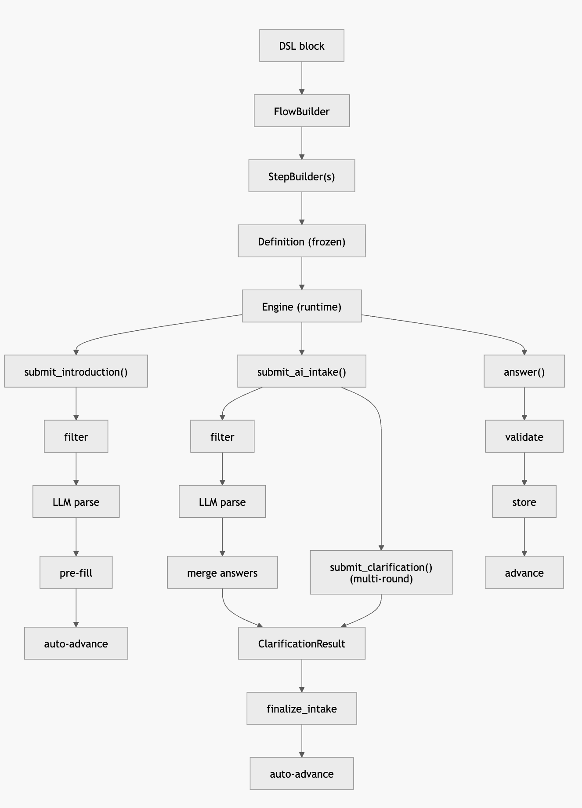

# FlowEngine

A pure Ruby, framework-agnostic gem providing a declarative DSL for building rules-driven wizards and intake forms. Separates flow logic, data schema, and UI rendering into independent concerns.

## Reference Materials

- [AGENT.md](./AGENT.md)
- [CLAUDE.md](./CLAUDE.md)
- [PROJECT STRUCTURE.md](./docs/PROJECT_STRUCTURE.md)

**Version**: 0.4.0 | **License**: MIT | **Ruby**: >= 4.0.1

## Quick Reference

```bash
just test           # Run RSpec + RuboCop
just lint           # RuboCop only
just format         # RuboCop auto-correct + auto-gen config
just doc            # Generate YARD docs and open browser
just clean          # Remove pkg/ and coverage/
just setup          # Install Ruby via rbenv + bundle install
just check-all      # lint + test
```

## Architecture

The following is the gem-level architecture that aims to decouple concerns and keep each gem responsible for it's part of the evaluation.



### Core Classes

| Class | Role | Mutable? |
|---|---|---|
| `FlowEngine` (module) | Entry point: `define(&block)`, `load_dsl(text)` | N/A |
| `Introduction` | DSL config: label, placeholder, maxlength for one-shot intro text | Frozen |
| `ClarificationResult` | Immutable result from an AI intake round (answered, pending, follow_up, round) | Frozen |
| `Definition` | Immutable flow graph (start_step_id + nodes + introduction) | Frozen |
| `Node` | Single step: id, type, question, options, fields, transitions, visibility_rule, max_clarifications | Frozen |
| `Transition` | Directed edge: target step + optional rule | Frozen |
| `Engine` | Runtime: current_step, answers, history, introduction_text, AI intake state | Mutable |
| `Engine::StateSerializer` | Symbolizes string-keyed state hashes from JSON round-trips | - |
| `Rules::Base` | Abstract rule: `evaluate(answers) -> bool`, `to_s` | Frozen |
| `Validation::Adapter` | Abstract validator interface | - |
| `LLM::Adapter` | Abstract LLM adapter: `chat(system_prompt:, user_prompt:, model:)` | - |
| `LLM::Client` | High-level: builds prompt, calls adapter, parses JSON response | - |
| `LLM::SystemPromptBuilder` | Builds system prompt for introduction pre-fill | - |
| `LLM::IntakePromptBuilder` | Builds system prompt for AI intake steps (with conversation context) | - |
| `LLM::SensitiveDataFilter` | Rejects text containing SSN, ITIN, EIN patterns | - |
| `Graph::MermaidExporter` | Exports Definition to Mermaid flowchart syntax | - |

### Error Hierarchy

```text
FlowEngine::Errors::Error < StandardError
  DefinitionError          # Invalid flow definition
  UnknownStepError         # Step id not found
  LLMError                 # LLM-related errors (missing key, parse failure)
  EngineError              # Runtime errors
    AlreadyFinishedError   # answer() called after flow ended
    ValidationError        # Validator rejected answer / maxlength exceeded
    SensitiveDataError     # Introduction/intake contains SSN, ITIN, EIN, etc.
```

### Data Flow

This diagram shows the interactions and connections between key component of FlowEngine ruby gem.



### Key Design Patterns

1. **Immutability**: Definition, Node, Transition, ClarificationResult, all Rule objects are frozen
2. **Builder pattern**: FlowBuilder + StepBuilder with instance_eval for readable DSL
3. **AST pattern**: Rules form an expression tree evaluated polymorphically
4. **Adapter pattern**: Validation::Adapter and LLM::Adapter for pluggable implementations
5. **First-match-wins**: Transitions evaluated in order; first matching rule determines next step
6. **State serialization**: Engine#to_state / Engine.from_state for session/DB persistence
7. **Two LLM modes**: Introduction (one-shot pre-fill) and AI intake (multi-round conversational)

## DSL Reference

```ruby
definition = FlowEngine.define do
  start :first_step

  # Optional: one-shot LLM pre-fill from free-form text
  introduction label: "Tell us about your situation",
               placeholder: "Describe your needs...",
               maxlength: 2000

  # AI intake step: multi-round conversational LLM extraction
  step :intake do
    type :ai_intake
    question "Tell us about your situation"
    max_clarifications 3   # 0 = one-shot, no follow-ups
    transition to: :first_step
  end

  step :first_step do
    type :multi_select
    question "What applies?"
    options %w[A B C]
    fields %w[Field1 Field2]          # for matrix-style steps
    decorations({ hint: "metadata" }) # opaque to engine, for UI

    transition to: :branch_a, if_rule: contains(:first_step, "A")
    transition to: :branch_b, if_rule: equals(:first_step, "B")
    transition to: :fallback  # unconditional fallback

    visible_if not_empty(:some_step)  # optional, for DAG mode
  end
end
```

### Rule Helpers

| Helper | Semantics |
|---|---|
| `contains(field, value)` | `answers[field].include?(value)` |
| `equals(field, value)` | `answers[field] == value` |
| `greater_than(field, n)` | `answers[field].to_i > n` |
| `less_than(field, n)` | `answers[field].to_i < n` |
| `not_empty(field)` | `!answers[field].nil? && !empty?` |
| `all(*rules)` | AND: all rules must be true |
| `any(*rules)` | OR: at least one rule must be true |

### Engine Usage

```ruby
engine = FlowEngine::Engine.new(definition)

# Option A: One-shot introduction pre-fill
client = FlowEngine::LLM.auto_client
engine.submit_introduction("I am married with 2 kids", llm_client: client)

# Option B: Multi-round AI intake (when current step is :ai_intake)
result = engine.submit_ai_intake("I'm married, 2 kids, W2 income", llm_client: client)
result.done?       # => false (LLM has follow-up)
result.follow_up   # => "Which state do you reside in?"
result.round       # => 1
result = engine.submit_clarification("California", llm_client: client)
result.done?       # => true

# Manual answers
engine.answer("some value")     # validates, stores, advances
engine.current_step             # => Node or nil
engine.finished?                # => Boolean
engine.answers                  # => { step_id: value, ... }
engine.history                  # => [:step1, :step2, ...]

# Persistence (includes AI intake state)
state = engine.to_state
restored = FlowEngine::Engine.from_state(definition, state)
```

## LLM Configuration

Model registry in `resources/models.yml` — override path via `${FLOWENGINE_LLM_MODELS_PATH}`.

```ruby
# Auto-detect from env (Anthropic > OpenAI > Gemini) based on environment variables set
# such as OPENAI_API_KEY or ANTHROPIC_API_KEY
client = FlowEngine::LLM.auto_client

# Explicitly assign an adapter
adapter = FlowEngine::LLM::Adapters::AnthropicAdapter.new(api_key: ENV["ANTHROPIC_API_KEY"])
client = FlowEngine::LLM::Client.new(adapter: adapter, model: "claude-sonnet-4-6")
```

### Sensitive Data Filter

`LLM::SensitiveDataFilter.check!(text)` rejects SSN, ITIN, EIN, and 9-digit patterns before any LLM call.

## Ecosystem

- **flowengine** (this gem): Core engine + LLM integration (depends on `ruby_llm`)
- **flowengine-cli**: Terminal UI adapter (TTY Toolkit)
- **flowengine-rails**: Rails engine with ActiveRecord + web views

## Code Style

- **Ruby 4.0+** target, **frozen_string_literal: true** on every file
- **Double quotes**, **120 char** line length, **20 line** method max
- RSpec with `rspec-its`, documentation format, SimpleCov for coverage

## Adding a New Rule Type

1. Create `lib/flowengine/rules/my_rule.rb` inheriting from `Rules::Base`
2. Implement `#evaluate(answers)` and `#to_s`; freeze in initialize
3. Add `require_relative` in `lib/flowengine.rb`
4. Add helper in `lib/flowengine/dsl/rule_helpers.rb`
5. Add specs in `spec/flowengine/rules/my_rule_spec.rb`

## Adding a New LLM Adapter

1. Create `lib/flowengine/llm/my_adapter.rb` inheriting from `LLM::Adapter`
2. Implement `#chat(system_prompt:, user_prompt:, model:)` returning response text (JSON)
3. Add `require_relative` in `lib/flowengine/llm.rb`
4. Add specs in `spec/flowengine/llm/my_adapter_spec.rb`
