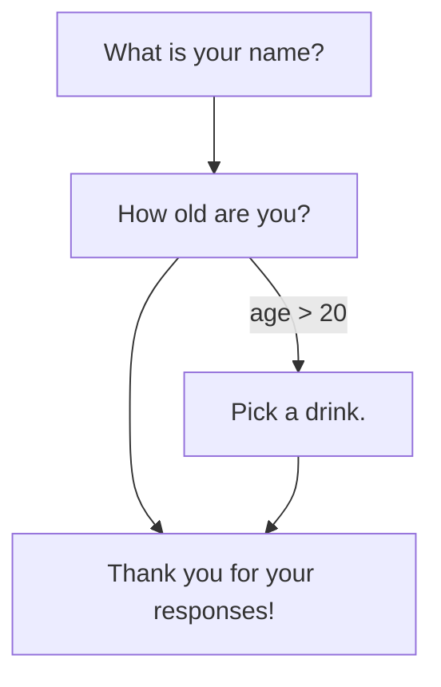
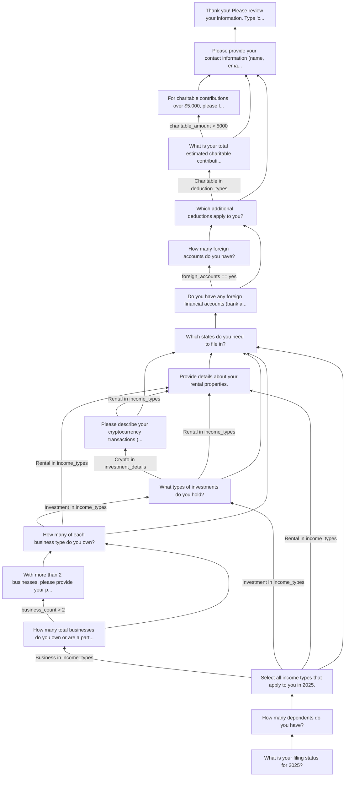

# FlowEngine

[](https://github.com/kigster/flowengine/actions/workflows/rspec.yml) &nbsp; [](https://github.com/kigster/flowengine/actions/workflows/rubocop.yml) &nbsp; 

This gem is the foundation of collecting complex multi-branch information from a user using a flow definition written in Ruby DSL. It shouldn't take too long to learn the DSL even for a non-technical person.

This gem does not have any UI or an interactive component. It is used as the foundation for additional gems that are built on top of this one, and provide various interactive interfaces for colleting information based on the DSL definition.

The simplest way to see this in action is to use the companion gem [`flowengine-cli`](https://rubygems.org/gems/flowengine-cli), which, given the flow DSL will walk the user through the questioniare according to the DSL flow definition, but using terminal UI and ASCII-based flow.

**A slightly different explanation is that it offere a declarative flow engine for building rules-driven wizards and intake forms in pure Ruby.**

> [!NOTE]
> FlowEngine lets you define multi-step flows as **directed graphs** with **conditional branching**, evaluate transitions using an **AST-based rule system**, and collect structured answers through a **stateful runtime engine** — all without framework dependencies.

> [!CAUTION]
> **This is not a form builder.** It's a *Form Definition Engine* that separates flow logic, data schema, and UI rendering into independent concerns.

## Installation

Add to your Gemfile:

```ruby
gem "flowengine"
```

Or install directly:

```bash
gem install flowengine
```

## Quick Start

```ruby
require "flowengine"

# 1. Define a flow
definition = FlowEngine.define do
  introduction label: "What are your favorite cocktails?",
               placeholder: "Old Fashion, Whisky Sour, etc",
               maxlength: 2000
  start :name

  step :name do
    type :text
    question "What is your name?"
    transition to: :age
  end

  step :age do
    type :number
    question "How old are you?"
    transition to: :beverage, if_rule: greater_than(:age, 20)
    transition to: :thanks
  end

  step :beverage do
    type :single_select
    question "Pick a drink."
    options %w[Beer Wine Cocktail]
    transition to: :thanks
  end

  step :thanks do
    type :text
    question "Thank you for your responses!"
  end
end

# 2. Run the engine
engine = FlowEngine::Engine.new(definition)

engine.answer("Alice")       # :name    -> :age
engine.answer(25)            # :age     -> :beverage  (25 > 20)
engine.answer("Wine")        # :beverage -> :thanks
engine.answer("ok")          # :thanks  -> finished

engine.finished?  # => true
engine.answers
# => { name: "Alice", age: 25, beverage: "Wine", thanks: "ok" }
engine.history
# => [:name, :age, :beverage, :thanks]
```

If Alice were 18 instead, the engine would skip `:beverage` entirely:

```ruby
engine.answer("Alice")       # :name    -> :age
engine.answer(18)            # :age     -> :thanks  (18 is NOT > 20)
engine.answer("ok")          # :thanks  -> finished

engine.answers
# => { name: "Alice", age: 18, thanks: "ok" }
engine.history
# => [:name, :age, :thanks]
```

### Using the `flowengine-cli` gem to Generate the JSON Answers File

## LLM-parsed Introduction

FlowEngine supports an optional **introduction step** that collects free-form text from the user before the structured flow begins. An LLM parses this text to pre-fill answers, automatically skipping steps the user already answered in their introduction.

### Defining an Introduction

Add the `introduction` command to your flow definition:

```ruby
definition = FlowEngine.define do
  start :filing_status

  introduction label: "Tell us about your tax situation",
               placeholder: "e.g. I am married, filing jointly, with 2 dependents...",
               maxlength: 2000  # optional character limit

  step :filing_status do
    type :single_select
    question "What is your filing status?"
    options %w[single married_filing_jointly head_of_household]
    transition to: :dependents
  end

  step :dependents do
    type :number
    question "How many dependents?"
    transition to: :income_types
  end

  step :income_types do
    type :multi_select
    question "Select income types"
    options %w[W2 1099 Business Investment]
  end
end
```

| Parameter | Required | Description |
|-----------|----------|-------------|
| `label` | Yes | Text shown above the input field |
| `placeholder` | No | Ghost text inside the text area (default: `""`) |
| `maxlength` | No | Maximum character count (default: `nil` = unlimited) |

### Using the Introduction at Runtime

```ruby
# 1. Configure an LLM adapter and client
adapter = FlowEngine::LLM::OpenAIAdapter.new(api_key: ENV["OPENAI_API_KEY"])
client = FlowEngine::LLM::Client.new(adapter: adapter, model: "gpt-4o-mini")

# 2. Create the engine and submit the introduction
engine = FlowEngine::Engine.new(definition)
engine.submit_introduction(
  "I am married filing jointly with 2 dependents, W2 and business income",
  llm_client: client
)

# 3. The LLM pre-fills answers and the engine auto-advances
engine.answers
# => { filing_status: "married_filing_jointly", dependents: 2,
#      income_types: ["W2", "Business"] }

engine.current_step_id    # => nil (all steps pre-filled in this case)
engine.introduction_text  # => "I am married filing jointly with 2 dependents, ..."
engine.finished?          # => true
```

If the LLM can only extract some answers, the engine stops at the first unanswered step and the user continues the flow normally from there.

### Sensitive Data Protection

Before any text reaches the LLM, `submit_introduction` scans for sensitive data patterns:

- **SSN**: `123-45-6789`
- **ITIN**: `912-34-5678`
- **EIN**: `12-3456789`
- **Nine consecutive digits**: `123456789`

If detected, a `FlowEngine::SensitiveDataError` is raised immediately. The introduction text is discarded and no LLM call is made.

```ruby
engine.submit_introduction("My SSN is 123-45-6789", llm_client: client)
# => raises FlowEngine::SensitiveDataError
```

### Custom LLM Adapters

The LLM integration uses an adapter pattern. The gem ships with an OpenAI adapter (via the [`ruby_llm`](https://github.com/crmne/ruby_llm) gem), but you can create adapters for any provider:

```ruby
class MyAnthropicAdapter < FlowEngine::LLM::Adapter
  def initialize(api_key:)
    super()
    @api_key = api_key
  end

  def chat(system_prompt:, user_prompt:, model:)
    # Call your LLM API here
    # Must return the response text (expected to be a JSON string)
  end
end

adapter = MyAnthropicAdapter.new(api_key: ENV["ANTHROPIC_API_KEY"])
client = FlowEngine::LLM::Client.new(adapter: adapter, model: "claude-sonnet-4-20250514")
```

### State Persistence

The `introduction_text` is included in state serialization:

```ruby
state = engine.to_state
# => { current_step_id: ..., answers: { ... }, history: [...], introduction_text: "..." }

restored = FlowEngine::Engine.from_state(definition, state)
restored.introduction_text  # => "I am married filing jointly..."
```

## Architecture


The core has **zero UI logic**, **zero DB logic**, and **zero framework dependencies**. Adapters translate input/output, persist state, and render UI.

### Core Components

| Component | Responsibility |
|-----------|---------------|
| `FlowEngine.define` | DSL entry point; returns a frozen `Definition` |
| `Introduction` | Immutable config for the introduction step (label, placeholder, maxlength) |
| `Definition` | Immutable container of the flow graph (nodes + start step + introduction) |
| `Node` | A single step: type, question, options/fields, transitions, visibility |
| `Transition` | A directed edge with an optional rule condition |
| `Rules::*` | AST nodes for conditional logic (`Contains`, `Equals`, `All`, etc.) |
| `Evaluator` | Evaluates rules against the current answer store |
| `Engine` | Stateful runtime: tracks current step, answers, history, and introduction |
| `Validation::Adapter` | Interface for pluggable validation (dry-validation, JSON Schema, etc.) |
| `LLM::Adapter` | Abstract interface for LLM API calls |
| `LLM::OpenAIAdapter` | OpenAI implementation via `ruby_llm` gem |
| `LLM::Client` | High-level: builds prompt, calls adapter, parses JSON response |
| `LLM::SensitiveDataFilter` | Rejects text containing SSN, ITIN, EIN patterns |
| `Graph::MermaidExporter` | Exports the flow definition as a Mermaid diagram |

## The DSL

### Defining a Flow

Every flow starts with `FlowEngine.define`, which returns a **frozen, immutable** `Definition`:

```ruby
definition = FlowEngine.define do
  start :first_step     # Required: which node to begin at

  # Optional: collect free-form text before the flow, parsed by LLM
  introduction label: "Describe your situation",
               placeholder: "Type here...",
               maxlength: 2000

  step :first_step do
    # step configuration...
  end

  step :second_step do
    # step configuration...
  end
end
```

### Step Configuration

Inside a `step` block, you have access to:

| Method | Purpose | Example |
|--------|---------|---------|
| `type` | The input type (for UI adapters) | `:text`, `:number`, `:single_select`, `:multi_select`, `:number_matrix` |
| `question` | The prompt shown to the user | `"What is your filing status?"` |
| `options` | Available choices (for select types) | `%w[W2 1099 Business]` |
| `fields` | Named fields (for matrix types) | `%w[RealEstate SCorp LLC]` |
| `transition` | Where to go next (with optional condition) | `transition to: :next_step, if_rule: equals(:field, "value")` |
| `visible_if` | Visibility rule (for DAG mode) | `visible_if contains(:income, "Rental")` |

### Step Types

Step types are semantic labels consumed by UI adapters. The engine itself is type-agnostic — it stores whatever value you pass to `engine.answer(value)`. The types communicate intent to renderers:

```ruby
step :filing_status do
  type :single_select                    # One choice from a list
  question "What is your filing status?"
  options %w[single married_filing_jointly married_filing_separately head_of_household]
  transition to: :dependents
end

step :income_types do
  type :multi_select                     # Multiple choices from a list
  question "Select all income types."
  options %w[W2 1099 Business Investment Rental]
  transition to: :business, if_rule: contains(:income_types, "Business")
  transition to: :summary
end

step :dependents do
  type :number                           # A numeric value
  question "How many dependents?"
  transition to: :income_types
end

step :business_details do
  type :number_matrix                    # Multiple named numeric fields
  question "How many of each business type?"
  fields %w[RealEstate SCorp CCorp Trust LLC]
  transition to: :summary
end

step :notes do
  type :text                             # Free-form text
  question "Any additional notes?"
  transition to: :summary
end
```

### Transitions

Transitions define the edges of the flow graph. They are evaluated **in order** — the first matching transition wins:

```ruby
step :income_types do
  type :multi_select
  question "Select income types."
  options %w[W2 1099 Business Investment Rental]

  # Conditional transitions (checked in order)
  transition to: :business_count,      if_rule: contains(:income_types, "Business")
  transition to: :investment_details,  if_rule: contains(:income_types, "Investment")
  transition to: :rental_details,      if_rule: contains(:income_types, "Rental")

  # Unconditional fallback (always matches)
  transition to: :state_filing
end
```

**Key behavior:** Only the *first* matching transition fires. If the user selects `["Business", "Investment", "Rental"]`, the engine goes to `:business_count` first. The subsequent steps must themselves include transitions to eventually reach `:investment_details` and `:rental_details`.

A transition with no `if_rule:` always matches — use it as a fallback at the end of the list.

### Visibility Rules

Nodes can have visibility conditions for DAG-mode rendering, where a UI adapter shows/hides steps dynamically:

```ruby
step :spouse_income do
  type :number
  question "What is your spouse's annual income?"
  visible_if equals(:filing_status, "married_filing_jointly")
  transition to: :deductions
end
```

The engine exposes this via `node.visible?(answers)`, which returns `true` when the rule is satisfied (or when no visibility rule is set).

## Rule System

Rules are **AST objects** — not hashes, not strings. They are immutable, composable, and evaluate polymorphically.

### Atomic Rules

| Rule | DSL Helper | Evaluates | String Representation |
|------|------------|-----------|----------------------|
| `Contains` | `contains(:field, "val")` | `Array(answers[:field]).include?("val")` | `val in field` |
| `Equals` | `equals(:field, "val")` | `answers[:field] == "val"` | `field == val` |
| `GreaterThan` | `greater_than(:field, 10)` | `answers[:field].to_i > 10` | `field > 10` |
| `LessThan` | `less_than(:field, 5)` | `answers[:field].to_i < 5` | `field < 5` |
| `NotEmpty` | `not_empty(:field)` | `answers[:field]` is not nil and not empty | `field is not empty` |

### Composite Rules

Combine atomic rules with boolean logic:

```ruby
# AND — all conditions must be true
transition to: :special_review,
           if_rule: all(
             equals(:filing_status, "married_filing_jointly"),
             contains(:income_types, "Business"),
             greater_than(:business_count, 2)
           )

# OR — at least one condition must be true
transition to: :alt_path,
           if_rule: any(
             contains(:income_types, "Investment"),
             contains(:income_types, "Rental")
           )
```

Composites nest arbitrarily:

```ruby
transition to: :complex_review,
           if_rule: all(
             equals(:filing_status, "married_filing_jointly"),
             any(
               greater_than(:business_count, 3),
               contains(:income_types, "Rental")
             ),
             not_empty(:dependents)
           )
```

### How Rules Evaluate

Every rule implements `evaluate(answers)` where `answers` is the engine's hash of `{ step_id => value }`:

```ruby
rule = FlowEngine::Rules::Contains.new(:income_types, "Business")
rule.evaluate({ income_types: ["W2", "Business"] })  # => true
rule.evaluate({ income_types: ["W2"] })               # => false

rule = FlowEngine::Rules::All.new(
  FlowEngine::Rules::Equals.new(:status, "married"),
  FlowEngine::Rules::GreaterThan.new(:dependents, 0)
)
rule.evaluate({ status: "married", dependents: 2 })   # => true
rule.evaluate({ status: "single", dependents: 2 })    # => false
```

## Engine API

### Creating and Running

```ruby
definition = FlowEngine.define { ... }
engine = FlowEngine::Engine.new(definition)
```

### Methods

| Method | Returns | Description |
|--------|---------|-------------|
| `engine.current_step_id` | `Symbol` or `nil` | The ID of the current step |
| `engine.current_step` | `Node` or `nil` | The current Node object |
| `engine.answer(value)` | `nil` | Records the answer and advances |
| `engine.submit_introduction(text, llm_client:)` | `nil` | LLM-parses text, pre-fills answers, auto-advances |
| `engine.finished?` | `Boolean` | `true` when there are no more steps |
| `engine.answers` | `Hash` | All collected answers `{ step_id => value }` |
| `engine.history` | `Array<Symbol>` | Ordered list of visited step IDs |
| `engine.introduction_text` | `String` or `nil` | The raw introduction text submitted |
| `engine.definition` | `Definition` | The immutable flow definition |

### Error Handling

```ruby
# Answering after the flow is complete
engine.answer("extra")
# => raises FlowEngine::AlreadyFinishedError

# Referencing an unknown step in a definition
definition.step(:nonexistent)
# => raises FlowEngine::UnknownStepError

# Invalid definition (start step doesn't exist)
FlowEngine.define do
  start :missing
  step :other do
    type :text
    question "Hello"
  end
end
# => raises FlowEngine::DefinitionError

# Sensitive data in introduction
engine.submit_introduction("My SSN is 123-45-6789", llm_client: client)
# => raises FlowEngine::SensitiveDataError

# Introduction exceeds maxlength
engine.submit_introduction("A" * 3000, llm_client: client)
# => raises FlowEngine::ValidationError

# Missing API key or LLM response parsing failure
FlowEngine::LLM::OpenAIAdapter.new  # without OPENAI_API_KEY
# => raises FlowEngine::LLMError
```

## Validation

The engine accepts a pluggable validator via the adapter pattern. The core gem ships with a `NullAdapter` (always passes) and defines the interface for custom adapters:

```ruby
# The adapter interface
class FlowEngine::Validation::Adapter
  def validate(node, input)
    # Must return a FlowEngine::Validation::Result
    raise NotImplementedError
  end
end

# Result object
FlowEngine::Validation::Result.new(valid: true, errors: [])
FlowEngine::Validation::Result.new(valid: false, errors: ["must be a number"])
```

### Custom Validator Example

```ruby
class MyValidator < FlowEngine::Validation::Adapter
  def validate(node, input)
    errors = []

    case node.type
    when :number
      errors << "must be a number" unless input.is_a?(Numeric)
    when :single_select
      errors << "invalid option" unless node.options&.include?(input)
    when :multi_select
      unless input.is_a?(Array) && input.all? { |v| node.options&.include?(v) }
        errors << "invalid options"
      end
    end

    FlowEngine::Validation::Result.new(valid: errors.empty?, errors: errors)
  end
end

engine = FlowEngine::Engine.new(definition, validator: MyValidator.new)
engine.answer("not_a_number")  # => raises FlowEngine::ValidationError
```

## Mermaid Diagram Export

Export any flow definition as a [Mermaid](https://mermaid.js.org/) flowchart:

```ruby
exporter = FlowEngine::Graph::MermaidExporter.new(definition)
puts exporter.export
```

Output:



## Complete Example: Tax Intake Flow

Here's a realistic 17-step tax intake wizard that demonstrates every feature of the DSL.

### Flow Definition

```ruby
tax_intake = FlowEngine.define do
  start :filing_status

  step :filing_status do
    type :single_select
    question "What is your filing status for 2025?"
    options %w[single married_filing_jointly married_filing_separately head_of_household]
    transition to: :dependents
  end

  step :dependents do
    type :number
    question "How many dependents do you have?"
    transition to: :income_types
  end

  step :income_types do
    type :multi_select
    question "Select all income types that apply to you in 2025."
    options %w[W2 1099 Business Investment Rental Retirement]
    transition to: :business_count,      if_rule: contains(:income_types, "Business")
    transition to: :investment_details,  if_rule: contains(:income_types, "Investment")
    transition to: :rental_details,      if_rule: contains(:income_types, "Rental")
    transition to: :state_filing
  end

  step :business_count do
    type :number
    question "How many total businesses do you own or are a partner in?"
    transition to: :complex_business_info, if_rule: greater_than(:business_count, 2)
    transition to: :business_details
  end

  step :complex_business_info do
    type :text
    question "With more than 2 businesses, please provide your primary EIN and a brief description of each entity."
    transition to: :business_details
  end

  step :business_details do
    type :number_matrix
    question "How many of each business type do you own?"
    fields %w[RealEstate SCorp CCorp Trust LLC]
    transition to: :investment_details, if_rule: contains(:income_types, "Investment")
    transition to: :rental_details,    if_rule: contains(:income_types, "Rental")
    transition to: :state_filing
  end

  step :investment_details do
    type :multi_select
    question "What types of investments do you hold?"
    options %w[Stocks Bonds Crypto RealEstate MutualFunds]
    transition to: :crypto_details,  if_rule: contains(:investment_details, "Crypto")
    transition to: :rental_details,  if_rule: contains(:income_types, "Rental")
    transition to: :state_filing
  end

  step :crypto_details do
    type :text
    question "Please describe your cryptocurrency transactions (exchanges used, approximate number of transactions)."
    transition to: :rental_details, if_rule: contains(:income_types, "Rental")
    transition to: :state_filing
  end

  step :rental_details do
    type :number_matrix
    question "Provide details about your rental properties."
    fields %w[Residential Commercial Vacation]
    transition to: :state_filing
  end

  step :state_filing do
    type :multi_select
    question "Which states do you need to file in?"
    options %w[California NewYork Texas Florida Illinois Other]
    transition to: :foreign_accounts
  end

  step :foreign_accounts do
    type :single_select
    question "Do you have any foreign financial accounts (bank accounts, securities, or financial assets)?"
    options %w[yes no]
    transition to: :foreign_account_details, if_rule: equals(:foreign_accounts, "yes")
    transition to: :deduction_types
  end

  step :foreign_account_details do
    type :number
    question "How many foreign accounts do you have?"
    transition to: :deduction_types
  end

  step :deduction_types do
    type :multi_select
    question "Which additional deductions apply to you?"
    options %w[Medical Charitable Education Mortgage None]
    transition to: :charitable_amount, if_rule: contains(:deduction_types, "Charitable")
    transition to: :contact_info
  end

  step :charitable_amount do
    type :number
    question "What is your total estimated charitable contribution amount for 2025?"
    transition to: :charitable_documentation, if_rule: greater_than(:charitable_amount, 5000)
    transition to: :contact_info
  end

  step :charitable_documentation do
    type :text
    question "For charitable contributions over $5,000, please list the organizations and amounts."
    transition to: :contact_info
  end

  step :contact_info do
    type :text
    question "Please provide your contact information (name, email, phone)."
    transition to: :review
  end

  step :review do
    type :text
    question "Thank you! Please review your information. Type 'confirm' to submit."
  end
end
```

### Scenario 1: Maximum Path (17 steps visited)

A married filer with all income types, 4 businesses, crypto, rentals, foreign accounts, and high charitable giving:

```ruby
engine = FlowEngine::Engine.new(tax_intake)

engine.answer("married_filing_jointly")
engine.answer(3)
engine.answer(%w[W2 1099 Business Investment Rental Retirement])
engine.answer(4)
engine.answer("EIN: 12-3456789. Entities: Alpha LLC, Beta SCorp, Gamma LLC, Delta CCorp")
engine.answer({ "RealEstate" => 1, "SCorp" => 1, "CCorp" => 1, "Trust" => 0, "LLC" => 2 })
engine.answer(%w[Stocks Bonds Crypto RealEstate])
engine.answer("Coinbase and Kraken, approximately 150 transactions in 2025")
engine.answer({ "Residential" => 2, "Commercial" => 1, "Vacation" => 0 })
engine.answer(%w[California NewYork])
engine.answer("yes")
engine.answer(3)
engine.answer(%w[Medical Charitable Education Mortgage])
engine.answer(12_000)
engine.answer("Red Cross: $5,000; Habitat for Humanity: $4,000; Local Food Bank: $3,000")
engine.answer("Jane Smith, jane.smith@example.com, 555-123-4567")
engine.answer("confirm")
```

**Collected data:**

```json
{
  "filing_status": "married_filing_jointly",
  "dependents": 3,
  "income_types": ["W2", "1099", "Business", "Investment", "Rental", "Retirement"],
  "business_count": 4,
  "complex_business_info": "EIN: 12-3456789. Entities: Alpha LLC, Beta SCorp, Gamma LLC, Delta CCorp",
  "business_details": {
    "RealEstate": 1,
    "SCorp": 1,
    "CCorp": 1,
    "Trust": 0,
    "LLC": 2
  },
  "investment_details": ["Stocks", "Bonds", "Crypto", "RealEstate"],
  "crypto_details": "Coinbase and Kraken, approximately 150 transactions in 2025",
  "rental_details": {
    "Residential": 2,
    "Commercial": 1,
    "Vacation": 0
  },
  "state_filing": ["California", "NewYork"],
  "foreign_accounts": "yes",
  "foreign_account_details": 3,
  "deduction_types": ["Medical", "Charitable", "Education", "Mortgage"],
  "charitable_amount": 12000,
  "charitable_documentation": "Red Cross: $5,000; Habitat for Humanity: $4,000; Local Food Bank: $3,000",
  "contact_info": "Jane Smith, jane.smith@example.com, 555-123-4567",
  "review": "confirm"
}
```

**Path taken** (all 17 steps):

```
filing_status -> dependents -> income_types -> business_count ->
complex_business_info -> business_details -> investment_details ->
crypto_details -> rental_details -> state_filing -> foreign_accounts ->
foreign_account_details -> deduction_types -> charitable_amount ->
charitable_documentation -> contact_info -> review
```

### Scenario 2: Minimum Path (8 steps visited)

A single filer, W2 income only, no special deductions:

```ruby
engine = FlowEngine::Engine.new(tax_intake)

engine.answer("single")
engine.answer(0)
engine.answer(["W2"])
engine.answer(["Texas"])
engine.answer("no")
engine.answer(["None"])
engine.answer("John Doe, john.doe@example.com, 555-987-6543")
engine.answer("confirm")
```

**Collected data:**

```json
{
  "filing_status": "single",
  "dependents": 0,
  "income_types": ["W2"],
  "state_filing": ["Texas"],
  "foreign_accounts": "no",
  "deduction_types": ["None"],
  "contact_info": "John Doe, john.doe@example.com, 555-987-6543",
  "review": "confirm"
}
```

**Path taken** (8 steps — skipped 9 steps):

```
filing_status -> dependents -> income_types -> state_filing ->
foreign_accounts -> deduction_types -> contact_info -> review
```

**Skipped:** `business_count`, `complex_business_info`, `business_details`, `investment_details`, `crypto_details`, `rental_details`, `foreign_account_details`, `charitable_amount`, `charitable_documentation`.

### Scenario 3: Medium Path (12 steps visited)

Married, with business + investment income, low charitable giving:

```ruby
engine = FlowEngine::Engine.new(tax_intake)

engine.answer("married_filing_separately")
engine.answer(1)
engine.answer(%w[W2 Business Investment])
engine.answer(2)                                    # <= 2 businesses, no complex_business_info
engine.answer({ "RealEstate" => 0, "SCorp" => 1, "CCorp" => 0, "Trust" => 0, "LLC" => 1 })
engine.answer(%w[Stocks Bonds MutualFunds])          # no Crypto, no crypto_details
engine.answer(%w[California Illinois])
engine.answer("no")                                  # no foreign accounts
engine.answer(%w[Charitable Mortgage])
engine.answer(3000)                                  # <= 5000, no documentation needed
engine.answer("Alice Johnson, alice.j@example.com, 555-555-0100")
engine.answer("confirm")
```

**Collected data:**

```json
{
  "filing_status": "married_filing_separately",
  "dependents": 1,
  "income_types": ["W2", "Business", "Investment"],
  "business_count": 2,
  "business_details": {
    "RealEstate": 0,
    "SCorp": 1,
    "CCorp": 0,
    "Trust": 0,
    "LLC": 1
  },
  "investment_details": ["Stocks", "Bonds", "MutualFunds"],
  "state_filing": ["California", "Illinois"],
  "foreign_accounts": "no",
  "deduction_types": ["Charitable", "Mortgage"],
  "charitable_amount": 3000,
  "contact_info": "Alice Johnson, alice.j@example.com, 555-555-0100",
  "review": "confirm"
}
```

**Path taken** (12 steps):

```
filing_status -> dependents -> income_types -> business_count ->
business_details -> investment_details -> state_filing ->
foreign_accounts -> deduction_types -> charitable_amount ->
contact_info -> review
```

### Scenario 4: Rental + Foreign Accounts (10 steps visited)

Head of household, 1099 + rental income, foreign accounts, no charitable:

```ruby
engine = FlowEngine::Engine.new(tax_intake)

engine.answer("head_of_household")
engine.answer(2)
engine.answer(%w[1099 Rental])
engine.answer({ "Residential" => 1, "Commercial" => 0, "Vacation" => 1 })
engine.answer(["Florida"])
engine.answer("yes")
engine.answer(1)
engine.answer(%w[Medical Education])
engine.answer("Bob Lee, bob@example.com, 555-000-1111")
engine.answer("confirm")
```

**Collected data:**

```json
{
  "filing_status": "head_of_household",
  "dependents": 2,
  "income_types": ["1099", "Rental"],
  "rental_details": {
    "Residential": 1,
    "Commercial": 0,
    "Vacation": 1
  },
  "state_filing": ["Florida"],
  "foreign_accounts": "yes",
  "foreign_account_details": 1,
  "deduction_types": ["Medical", "Education"],
  "contact_info": "Bob Lee, bob@example.com, 555-000-1111",
  "review": "confirm"
}
```

**Path taken** (10 steps):

```
filing_status -> dependents -> income_types -> rental_details ->
state_filing -> foreign_accounts -> foreign_account_details ->
deduction_types -> contact_info -> review
```

### Comparing Collected Data Across Paths

The shape of the collected data depends entirely on which path the user takes through the graph. Here's a side-by-side of which keys appear in each scenario:

| Answer Key | Max (17) | Min (8) | Medium (12) | Rental (10) |
|---|:---:|:---:|:---:|:---:|
| `filing_status` | x | x | x | x |
| `dependents` | x | x | x | x |
| `income_types` | x | x | x | x |
| `business_count` | x | | x | |
| `complex_business_info` | x | | | |
| `business_details` | x | | x | |
| `investment_details` | x | | x | |
| `crypto_details` | x | | | |
| `rental_details` | x | | | x |
| `state_filing` | x | x | x | x |
| `foreign_accounts` | x | x | x | x |
| `foreign_account_details` | x | | | x |
| `deduction_types` | x | x | x | x |
| `charitable_amount` | x | | x | |
| `charitable_documentation` | x | | | |
| `contact_info` | x | x | x | x |
| `review` | x | x | x | x |

## Composing Complex Rules

### Example: Multi-Condition Branching

```ruby
definition = FlowEngine.define do
  start :status

  step :status do
    type :single_select
    question "Filing status?"
    options %w[single married]
    transition to: :dependents
  end

  step :dependents do
    type :number
    question "How many dependents?"
    transition to: :income
  end

  step :income do
    type :multi_select
    question "Income types?"
    options %w[W2 Business]

    # All three conditions must be true
    transition to: :special_review,
               if_rule: all(
                 equals(:status, "married"),
                 contains(:income, "Business"),
                 not_empty(:income)
               )

    # At least one condition must be true
    transition to: :alt_review,
               if_rule: any(
                 less_than(:dependents, 2),
                 contains(:income, "W2")
               )

    # Unconditional fallback
    transition to: :default_review
  end

  step :special_review do
    type :text
    question "Married with business income - special review required."
  end

  step :alt_review do
    type :text
    question "Alternative review path."
  end

  step :default_review do
    type :text
    question "Default review."
  end
end
```

The four possible outcomes:

| Inputs | Path | Why |
|--------|------|-----|
| married, 0 deps, `[W2, Business]` | `:special_review` | `all()` satisfied: married + Business + not empty |
| single, 0 deps, `[W2]` | `:alt_review` | `all()` fails (not married); `any()` passes (has W2) |
| single, 1 dep, `[Business]` | `:alt_review` | `all()` fails; `any()` passes (deps < 2) |
| single, 3 deps, `[Business]` | `:default_review` | `all()` fails; `any()` fails (deps not < 2, no W2) |

## Mermaid Diagram of the Tax Intake Flow


<details>
  <summary>Expand to see Mermaid source</summary>



</details>

## Ecosystem

FlowEngine is the core of a three-gem architecture:

| Gem | Purpose |
|-----|---------|
| **`flowengine`** (this gem) | Core engine + LLM introduction parsing (depends on `ruby_llm`) |
| **`flowengine-cli`** | Terminal wizard adapter using [TTY Toolkit](https://ttytoolkit.org/) + Dry::CLI |
| **`flowengine-rails`** | Rails Engine with ActiveRecord persistence and web views |

## Development

```bash
bundle install
bundle exec rspec
```

## License

The gem is available as open source under the terms of the [MIT License](https://opensource.org/licenses/MIT).
