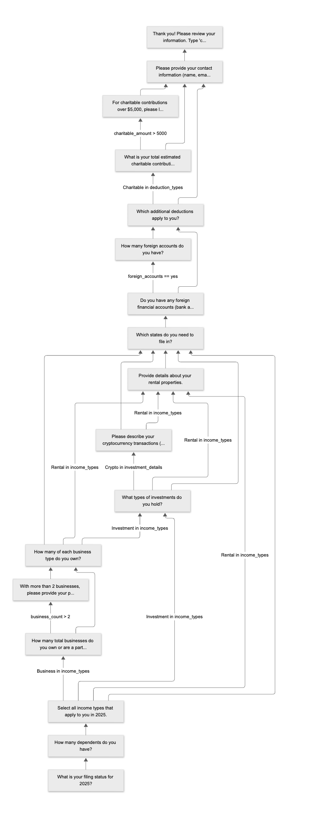
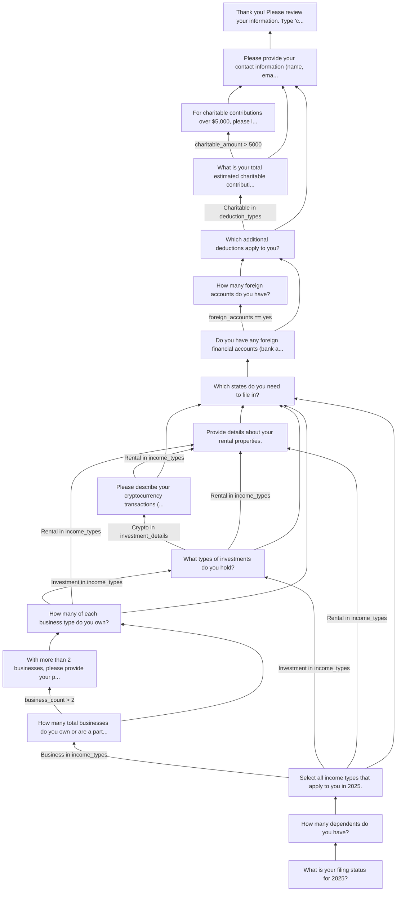

# Flowengine

> [!IMPORTANT]
>
> Gem's Responsibilities
>
> * DSL
> * Flow Definition
> * AST-based Rule system
> * Evaluator
> * Engine runtime
> * Validation adapter interface
> * Graph exporter (Mermaid)
> * Simulation runner
> * No ActiveRecord.
> * No Rails.
> * No terminal code.

### Proposed Gem Structure

```text
flowengine/
├── lib/
│   ├── flowengine.rb
│   ├── flowengine/
│   │   ├── definition.rb
│   │   ├── dsl.rb
│   │   ├── node.rb
│   │   ├── rule_ast.rb
│   │   ├── evaluator.rb
│   │   ├── engine.rb
│   │   ├── validation/
│   │   │   ├── adapter.rb
│   │   │   └── dry_validation_adapter.rb
│   │   ├── graph/
│   │   │   └── mermaid_exporter.rb
│   │   └── simulation.rb
├── exe/
│   └── flowengine
```

#### Core Concepts

Immutable structure representing flow graph.

```ruby
flowengine.define do
  start :earnings

  step :earnings do
    type :multi_select
    question "What are your main earnings?"
    options %w[W2 1099 BusinessOwnership]

    transition to: :business_details,
               if: contains(:earnings, "BusinessOwnership")
  end
end
```

Definition compiles DSL → Node objects → AST transitions.

No runtime state.

#### Engine (Pure Runtime)

```ruby
engine = flowengine::Engine.new(definition)

engine.current_step
engine.answer(value)
engine.finished?
engine.answers
```

Engine stores:

* current node id
* answer hash
* evaluator

No IO.

#### Rule AST (Clean & Extensible)

You want AST objects, not hash blobs.

```ruby
Contains.new(:earnings, "BusinessOwnership")
All.new(rule1, rule2)
Equals.new(:marital_status, "Married")
```

Evaluator does polymorphic dispatch:

```ruby
rule.evaluate(context)
```

Cleaner than giant case statements.

#### Validation (Dry Integration)

Adapter pattern:

```ruby
class DryValidationAdapter < Adapter
  def validate(step, input)
    step.schema.call(input)
  end
end
```

Core does:

```ruby
validator.validate(step, input)
```

IMPORTANT: Core does not depend directly on dry-validation.

#### Part 1b: CLI Layer (inside `flowengine-cli`)

CLI should be thin.

Use:

* dry-cli
* tty-prompt

NOTE: Dress up the CLI/Terminal interface a bit. Use as much of the TTY-Toolkit as needed.

#### Commands

```bash
flowengine run config.rb
flowengine graph config.rb --format=mermaid
flowengine simulate config.rb --answers=fixture.json
```

### Examples of Mermaid Charts



<details>
  <summary>Expand to See Mermaid Sources</summary>



</details>
